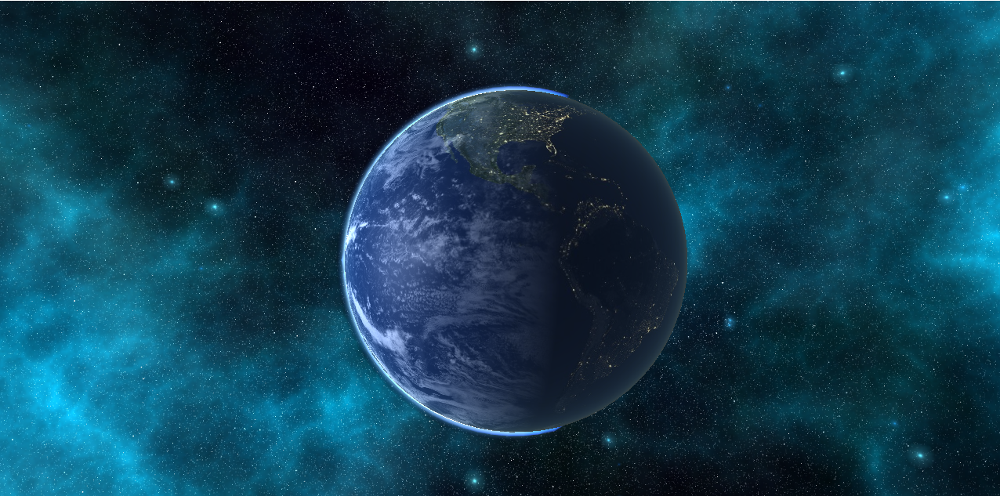
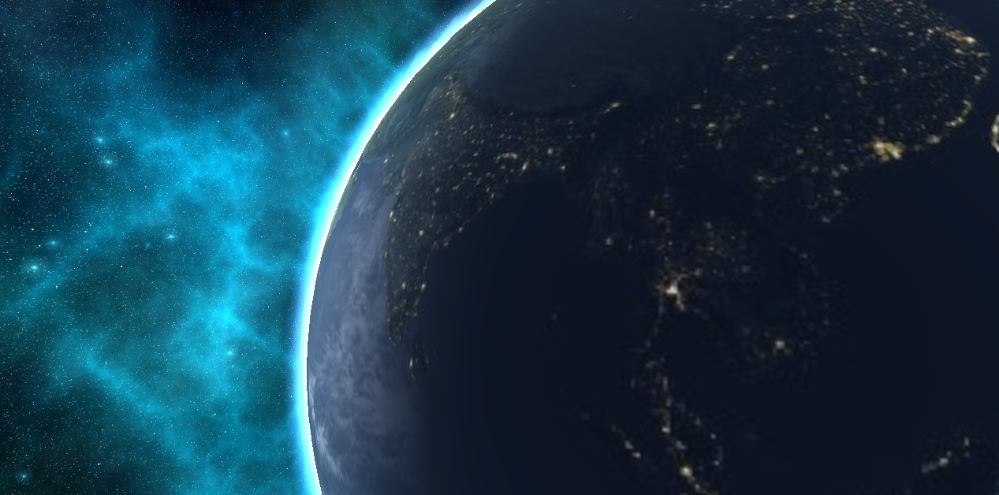

# glowing-chainsaw

This repository is meant for handling all the code I have written on my journey through _Seasons Of Code_, conducted by the Web and Coding Club of IIT Bombay **WnCC** in the months of April and May, 2020, after my first year.

You will find a well written Makefile which probably does not work.  
I think the local repositories explain themselves.

# Future Plans
Future plans for this project include:
1. Finding an appropriate mesh for **terrain generation**. Little mini project I am super excited about.
2. Implementing Mie and Rayleigh scattering for SkyfromSky shading.

Here is what the model looks like as of 9/7/20:

Bin: .exe files outputted after running make end up here
Images: All images used in the .cpp files are stored here. Skyboxes are stored in batches of six in individual folders.
Shaders: Contains all the shaders used to render.
utility: Contains header files for camera, shader, texture and skybox functions and their individual dependencies.
